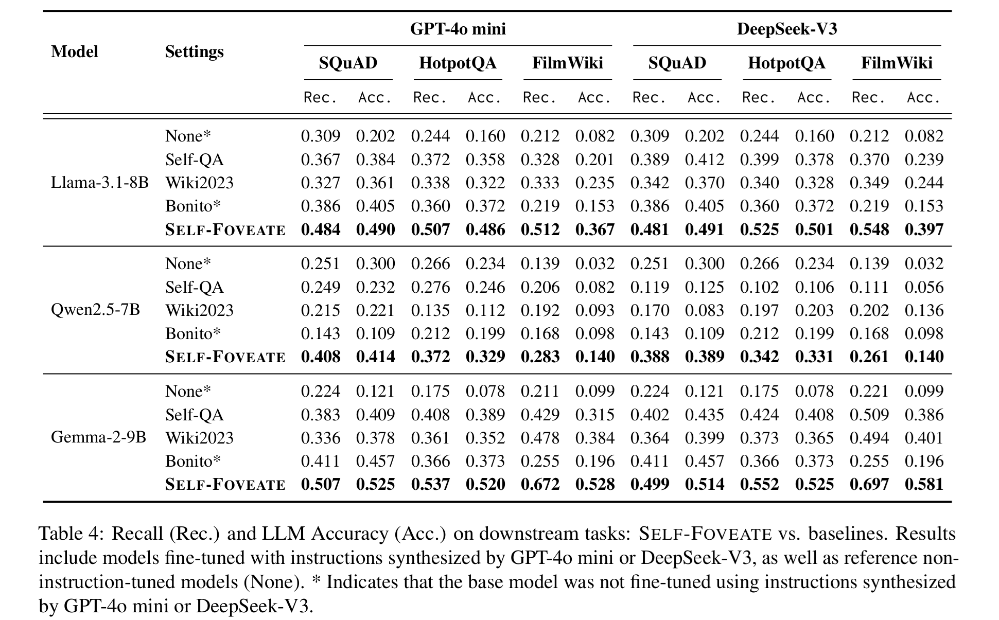

<div align="center">

# Self-Foveate: Enhancing Diversity and Difficulty of Synthesized Instructions from Unsupervised Text via Multi-Level Foveation

</div>

<div align="center" style="font-size: 15pt">

<a href='https://arxiv.org/abs/2507.23440'></a>
<a href='https://aclanthology.org/2025.findings-acl.380/'></a>

<h4 align="center">
    <p>
        <b>English</b> | <a href="README_zh.md">中文</a>
    </p>
</h4>

</div>


## 🎊 News <!-- omit in toc -->

- [2025.07.30] Our paper "Self-Foveate: Enhancing Diversity and Difficulty of Synthesized Instructions from Unsupervised Text via Multi-Level Foveation" has been published in Findings of ACL 2025! 📄 [[Paper](https://aclanthology.org/2025.findings-acl.380/)]


## 📜 Brief Introduction <!-- omit in toc -->

Self-Foveate is an innovative LLM-driven method for instruction synthesis that introduces a "Micro-Scatter-Macro" multi-level foveation methodology. This approach effectively guides the LLM to deeply excavate fine-grained information embedded in unsupervised text, thereby enhancing both the diversity and difficulty of synthesized instructions. Comprehensive experiments across multiple unsupervised corpora and diverse model architectures validate the effectiveness and superiority of our proposed method.

💡 **Micro-Scatter-Macro Foveation Methodology**. 
	Self-Foveate employs a novel multi-level foveation approach that effectively guides the LLM to deeply excavate fine-grained information embedded in unsupervised text.

🛠️ **Enhanced Diversity and Difficulty**.
  The framework generates instructions with superior diversity and difficulty compared to baseline methods, making it ideal for training more robust language models.

🚀 **Comprehensive Validation**.
    
  Comprehensive experiments across multiple unsupervised corpora and diverse model architectures validate the effectiveness and superiority of our proposed method.

<div align="center">  </div>

## 📌Contents <!-- omit in toc -->

- [Self-Foveate: Enhancing Diversity and Difficulty of Synthesized Instructions from Unsupervised Text via Multi-Level Foveation](#self-foveate-enhancing-diversity-and-difficulty-of-synthesized-instructions-from-unsupervised-text-via-multi-level-foveation)
  - [Installation](#installation)
  - [Quick Start](#quick-start)
  - [Evaluation](#evaluation)
  - [Citation](#citation)

## Installation

1. Clone this repository and navigate to Self-Foveate folder
```bash
git clone https://github.com/Mubuky/Self-Foveate.git
cd Self-Foveate
```

2. Install dependencies (Python 3.11)
```bash
pip install -r requirements.txt
```

## Quick Start

**Instruction Synthesis:**
```bash
python self_foveate.py --config ./config/[dataset].yaml
```

Below are the commands to run the instruction synthesis stage as in the paper:
```bash
# 🏠 SQuAD_2.5k
python self_foveate.py --config ./config/SQuAD_2.5k.yaml
# ❓ HotpotQA_2.5k
python self_foveate.py --config ./config/HotpotQA_2.5k.yaml
# 📚 FilmWiki
python self_foveate.py --config ./config/FilmWiki.yaml
```

## Evaluation
Waiting for update...


## Licenses <!-- omit in toc -->

[](LICENSE)

This project is licensed under the MIT License - see the LICENSE file for details.


## Citation

If you find our code/paper helpful, please consider cite our papers 📝 and star us ⭐️！

```bibtex
@inproceedings{li-etal-2025-self-foveate,
    title = "Self-Foveate: Enhancing Diversity and Difficulty of Synthesized Instructions from Unsupervised Text via Multi-Level Foveation",
    author = "Li, Mingzhe  and
      Lu, Xin  and
      Zhao, Yanyan",
    booktitle = "Findings of the Association for Computational Linguistics: ACL 2025",
    month = jul,
    year = "2025",
    publisher = "Association for Computational Linguistics",
    url = "https://aclanthology.org/2025.findings-acl.380/",
    pages = "7274--7289"
}
```

## Contact

If you have any questions, feel free to contact [Mingzhe Li](mailto:mzli@ir.hit.edu.cn)
