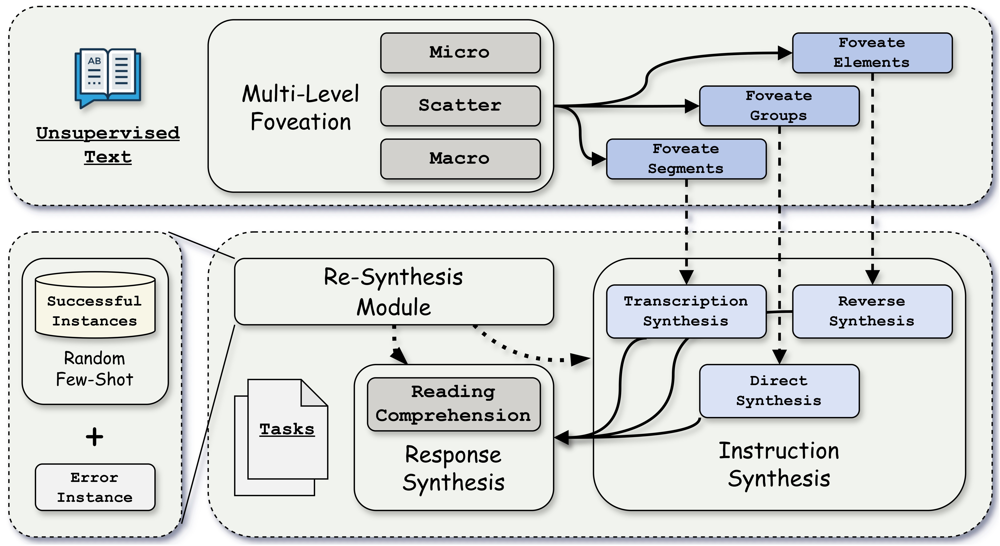

<div align="center">

# Self-Foveate: 通过多级凹视化增强无监督文本合成指令的多样性与难度

<a href='https://arxiv.org/abs/2507.23440'></a>
<a href='https://huggingface.co/papers/2507.23440'></a>
<a href='https://aclanthology.org/2025.findings-acl.380/'></a>
<a href='LICENSE'></a>
<a href='https://www.python.org/'></a>

[English](README.md) | 中文

</div>

## 🎊 新闻

- [2025.07] 📄 论文被 *ACL 2025 (Findings)* 录用。[[论文](https://aclanthology.org/2025.findings-acl.380/)]
- [2025.07] 📄 论文已在 arXiv 发布。[[arXiv](https://arxiv.org/abs/2507.23440)]

## 📌 目录

- [简介](#-简介)
- [安装](#-安装)
- [使用方法](#-使用方法)
- [评估](#-评估)
- [凹视化策略](#-凹视化策略)
- [引用](#-引用)
- [许可证](#-许可证)

## 📜 简介

Self-Foveate 是一个从无监督文本数据中自动合成高质量、多样化指令的框架。受人类视觉感知中凹视化机制的启发——眼睛以不同的细节层次聚焦于不同区域——该框架引导大语言模型在多个粒度上提取和处理文本信息。

**🤖 自动化的 LLM 驱动框架** — Self-Foveate 利用大语言模型从原始无监督文本中自动生成领域特定的指令数据集，无需人工标注或种子指令，同时保持高质量和相关性。

**🔬 微观-散射-宏观凹视化** — 我们提出了一种新颖的多级凹视化方法，引导大语言模型提取细粒度且多样化的信息：*微观*聚焦于单个词汇，*散射*组合多个关键词，*宏观*捕获完整句子作为上下文特征。

**📈 卓越的跨领域性能** — 大量实验表明，Self-Foveate 在多个无监督语料库（SQuAD、HotpotQA、FilmWiki）和模型架构上始终优于现有方法，在合成指令的多样性和难度方面取得更高水平。

<div align="center">

</div>

## 🛠️ 安装

### 环境要求
- Python 3.8+
- OpenAI API 密钥（或兼容的 API）

### 安装步骤

```bash
git clone https://github.com/Mubuky/Self-Foveate.git
cd Self-Foveate
pip install -r requirements.txt
```

### 配置

复制环境模板并添加您的 API 凭证：
```bash
cp .env.example .env
```

编辑 `.env`：
```
OPENAI_API_KEY=your-api-key-here
OPENAI_MODEL=gpt-4o  # 可选
OPENAI_BASE_URL=https://api.openai.com/v1  # 可选
```

### 数据格式

输入数据应为包含 `content` 字段的 JSONL 格式。详细规范请参见 [docs/DATA_FORMAT.md](docs/DATA_FORMAT.md)。

## 💻 使用方法

### 运行 Self-Foveate

```bash
# 基本用法
python self_foveate.py --data_path ./data/input_data/content.jsonl

# 完整参数
python self_foveate.py \
    --data_path ./data/input_data/content.jsonl \
    --output_path ./data/output_data/output.json \
    --mu 8.0 \
    --alpha 0.0 \
    --max_retries 5 \
    --num_sample 100 \
    --log_level INFO

# 使用重要关键词功能
python self_foveate.py \
    --data_path ./data/input_data/content.jsonl \
    --num_important 2 3
```

#### 命令行参数
| 参数 | 类型 | 默认值 | 描述 |
|------|------|--------|------|
| `--data_path` | str | 必需 | 输入 JSONL 数据文件 |
| `--output_path` | str | 自动 | 输出 JSON 文件（未指定时自动生成） |
| `--mu` | float | 8.0 | Box-Cox 目标均值 |
| `--alpha` | float | 0.0 | Box-Cox 缩放因子 |
| `--max_retries` | int | 5 | 最大 API 重试次数 |
| `--num_sample` | int | None | 采样数量（可选） |
| `--num_important` | int[2] | None | 重要关键词数量 [核心, 主要]（可选） |
| `--log_level` | str | INFO | 日志级别 (DEBUG/INFO/WARNING/ERROR) |
| `--log_dir` | str | ./log | 日志目录 |

## 📊 评估

### 多样性指标
```bash
# 所有指标（Self-BLEU + 嵌入）
python evaluation/diversity.py --input_path ./data/output_data/output.json --metric all

# 仅 Self-BLEU
python evaluation/diversity.py --input_path ./data/output_data/output.json --metric self_bleu

# 仅嵌入多样性
python evaluation/diversity.py --input_path ./data/output_data/output.json --metric embedding
```

### 难度评估
```bash
python evaluation/difficulty.py \
    --baseline_path ./data/output_data/baseline.json \
    --method_path ./data/output_data/method.json \
    --input_path ./data/input_data/content.jsonl \
    --output_dir ./data/output_data
```

### 模型评估
```bash
python evaluation/model_evaluation.py --dataset datasetname --output exp_name --num_round 5
```

## 🔍 凹视化策略

| 策略 | 层级 | 描述 | 特征类型 |
|------|------|------|----------|
| **宏观** | 句子 | 提取完整句子作为上下文特征 | 完整句子 |
| **微观** | 词汇 | 提取单个词汇作为细粒度特征 | 单个词汇 |
| **散射** | 多关键词 | 组合 1-3 个关键词形成多样化特征组 | 关键词组合 |

## 🔎 引用

如果您在研究中使用了本代码或方法，请引用我们的论文：

```bibtex
@inproceedings{li2025self,
  title={Self-Foveate: Enhancing Diversity and Difficulty of Synthesized Instructions from Unsupervised Text via Multi-Level Foveation},
  author={Li, Mingzhe and Lu, Xin and Zhao, Yanyan},
  booktitle={Findings of the Association for Computational Linguistics: ACL 2025},
  pages={7274--7289},
  year={2025}
}
```

## ⚖️ 许可证

本项目采用 MIT 许可证 - 详情请参见 [LICENSE](LICENSE) 文件。
